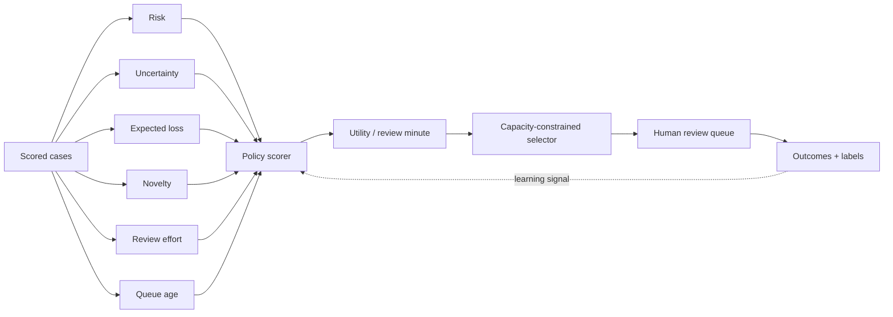

<div align="center">

# ReviewerIQ

### Put human attention where it changes the outcome.

**Capacity-constrained human-review optimization for security and fraud decision systems**

`Risk` · `Uncertainty` · `Expected loss` · `Novelty` · `Analyst capacity` · `Policy comparison`

</div>

<p align="center"></p>

---

## Product thesis

A high-quality model can still create a bad operational system if it sends more cases to humans than the team can review.

ReviewerIQ starts from the constraint that matters:

```text
Scored queue:        thousands of cases
Human capacity:      limited analyst hours
Question:            which cases deserve review first?
```

The project does **not** assume that “highest risk score first” is always the best policy. It considers immediate risk, uncertainty, expected loss, novelty, information value, queue age, and review effort under the same fixed capacity budget.

> **The optimization target is not only model confidence. It is the value of scarce human attention.**

---

## At a glance

| Layer | What ReviewerIQ optimizes |
|---|---|
| **Risk** | severe-case capture and expected synthetic loss |
| **Learning** | uncertainty, novelty, information gain |
| **Capacity** | analyst hours and per-case review effort |
| **Queue health** | backlog, queue age, severe cases left behind |
| **Policy** | random, risk-only, uncertainty-only, expected-value, hybrid |
| **Business** | risk caught per analyst hour and lift vs simpler policies |
| **Governance** | prioritization only; no autonomous enforcement |

The Streamlit dashboard now exposes **30+ queue, policy, risk, learning, and analyst-efficiency KPIs**.

---

## Example: why highest-risk-first can be suboptimal

Suppose two synthetic cases enter the queue.

### Case A

```text
Risk score          0.96
Uncertainty         0.04
Expected loss       $55
Novelty             0.05
Review time         22 min
```

### Case B

```text
Risk score          0.72
Uncertainty         0.61
Expected loss       $1,120
Novelty             0.88
Review time         8 min
```

A pure risk ranking chooses **Case A**.

ReviewerIQ may prioritize **Case B** because it combines:

- meaningful immediate risk
- much larger expected loss
- high novelty
- high uncertainty / learning value
- lower review effort

The project makes that tradeoff explicit and measurable.

---

## Architecture



---

## Five policies under the same budget

### 1. Random

A neutral baseline.

### 2. Risk-only

Prioritize the highest model risk.

### 3. Uncertainty-only

Prioritize cases where the model is least certain.

### 4. Expected-value

Combine risk with expected synthetic loss.

### 5. Hybrid

Balance:

```text
risk
+ expected loss
+ uncertainty
+ novelty
+ queue age
- review effort
```

The default implementation ranks by **utility per review minute** and selects cases until the analyst-hour budget is exhausted.

---

## Dashboard

The interface uses the same Apple-inspired product language as the rest of the portfolio: clean white space, soft-gray surfaces, rounded cards, system typography, restrained color, and executive-first storytelling.

### KPI families

**Capacity**
- queue size
- analyst-hour budget
- selected cases
- queue compression ratio
- capacity utilization
- capacity remaining
- review hours consumed
- cases reviewed per hour

**Risk**
- severe prevalence
- total severe cases
- severe cases caught / missed
- severe recall
- selected severe rate
- risk caught
- risk capture rate
- risk caught per analyst hour
- severe cases caught per hour

**Policy comparison**
- risk-only baseline
- random baseline
- lift vs risk-only
- lift vs random
- best policy under current budget

**Learning value**
- mean information gain
- total information value
- novelty coverage
- high-novelty reviews
- high-uncertainty reviews

**Queue quality**
- average / P95 review time
- selected vs overall risk
- selected vs overall novelty
- selected vs overall uncertainty
- P95 queue age
- backlog size

---

## Optimization objective

The reference hybrid score is intentionally transparent rather than hidden inside a black-box optimizer.

Conceptually:

```text
priority =
    immediate risk value
  + expected loss value
  + uncertainty value
  + novelty value
  + queue-age value
```

Then:

```text
review utility = priority × information value / review minutes
```

Cases are selected until the fixed review budget is consumed.

This gives the project a clear operational unit:

> **How much risk and learning value did each analyst hour buy?**

---

## Efficiency frontier

The dashboard compares policies on:

```text
x-axis → risk caught per analyst hour
y-axis → severe-case recall
bubble  → information gain
```

That makes tradeoffs visible rather than forcing everything into a single score.

A policy can be:

- efficient but narrow
- broad but expensive
- good for learning but weak for immediate loss prevention
- strong on both and therefore Pareto-preferred

---

## Repository map

```text
.
├── app.py                     # Apple-inspired review-operations dashboard
├── engine.py                  # generator, policy scoring, capacity selector
├── tests/test_engine.py
├── reports/evaluation.md
├── assets/dashboard-preview.svg
├── .streamlit/config.toml
├── .github/workflows/ci.yml
├── Dockerfile
└── requirements.txt
```

---

## Run locally

```bash
pip install -r requirements.txt
python engine.py --out artifacts --capacity-hours 80 --policy hybrid
streamlit run app.py
```

The CLI writes selected reviews, the policy-comparison table, and summary KPIs.

---

## What this project is demonstrating

ReviewerIQ is designed to show thinking across:

- human-in-the-loop ML systems
- active-learning signals
- expected-loss decisioning
- constrained optimization
- capacity planning
- queue prioritization
- security/fraud review operations
- policy comparison
- business-value measurement
- model uncertainty and novelty

---

## Responsible interpretation

The queue, severe outcomes, expected losses, and “risk caught” values are **synthetic**. ReviewerIQ prioritizes review candidates; it does not automatically block, punish, or enforce an outcome. The utility function is a reference design and should be calibrated to real operational constraints before any production use.

<div align="center">

### Optimize the review budget, not just the risk score.

</div>
