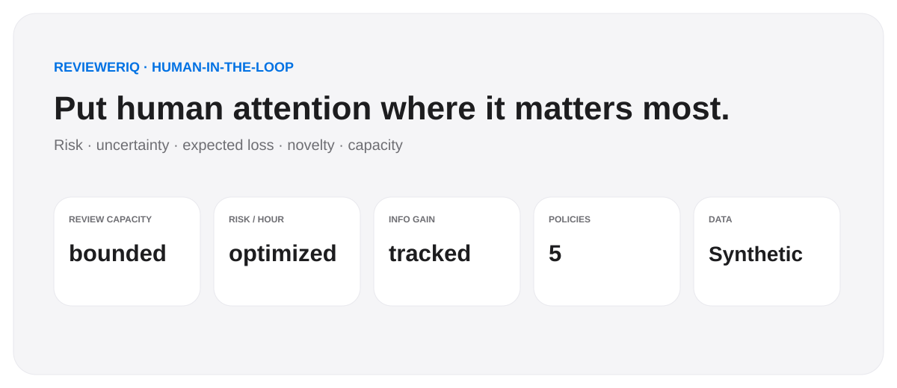
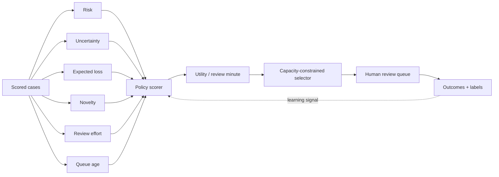

<div align="center">

# ReviewerIQ

### Put human attention where it changes the outcome.

**Capacity-constrained human-review optimization for security and fraud decision systems**

`Risk` · `Uncertainty` · `Expected loss` · `Novelty` · `Analyst capacity` · `Policy comparison`\n\n[](https://github.com/VinayK88/ReviewerIQ/actions/workflows/ci.yml) [](https://www.python.org/) [](LICENSE)

</div>

<p align="center"></p>

---

## Product thesis

A high-quality model can still create a bad operational system if it sends more cases to humans than the team can review.

ReviewerIQ starts from the constraint that matters:

```text
Scored queue:        thousands of cases
Human capacity:      limited analyst hours
Question:            which cases deserve review first?
```

The project does **not** assume that “highest risk score first” is always the best policy. It considers immediate risk, uncertainty, expected loss, novelty, information value, queue age, and review effort under the same fixed capacity budget.

> **The optimization target is not only model confidence. It is the value of scarce human attention.**

---

## At a glance

| Layer | What ReviewerIQ optimizes |
|---|---|
| **Risk** | severe-case capture and expected synthetic loss |
| **Learning** | uncertainty, novelty, information gain |
| **Capacity** | analyst hours and per-case review effort |
| **Queue health** | backlog, queue age, severe cases left behind |
| **Policy** | random, risk-only, uncertainty-only, expected-value, hybrid |
| **Business** | risk caught per analyst hour and lift vs simpler policies |
| **Governance** | prioritization only; no autonomous enforcement |

The Streamlit dashboard exposes **30+ queue, policy, risk, learning, and analyst-efficiency KPIs**. Capacity allocation skips cases that do not fit the remaining budget and continues evaluating smaller candidates.

---

## Example: why highest-risk-first can be suboptimal

Suppose two cases enter the queue.

```text
Case A
Risk score          0.96
Uncertainty         0.04
Expected loss       $55
Novelty             0.05
Review time         22 min

Case B
Risk score          0.72
Uncertainty         0.61
Expected loss       $1,120
Novelty             0.88
Review time         8 min
```

A pure risk ranking chooses **Case A**. ReviewerIQ may prioritize **Case B** because it combines meaningful immediate risk, much larger expected loss, high novelty, high uncertainty/learning value, and lower review effort.

---

## Architecture



---

## Five policies under the same budget

ReviewerIQ compares **random**, **risk-only**, **uncertainty-only**, **expected-value**, and **hybrid** selection under the same analyst-hour budget. The hybrid policy balances risk, expected loss, uncertainty, novelty, queue age, and review effort and ranks by **utility per review minute**.

The dashboard then compares severe-case recall, review precision, risk caught per analyst hour, information gain, novelty coverage, backlog, queue age, and missed severe cases.

---

## Connecting ReviewerIQ to real data

ReviewerIQ can sit downstream of an existing model, rules engine, SIEM, fraud platform, case-management system, or analyst queue. It does **not** require replacing the current detector—the required input is a queue of cases with prioritization signals and an estimate of review effort.

### Minimum case contract

```text
case_id             string
created_time        timestamp
risk                0..1
uncertainty         0..1 optional
expected_loss       numeric optional
novelty             0..1 optional
review_minutes      numeric
age_hours           numeric / derived
```

For evaluation, add the eventual review outcome:

```text
severe / confirmed_issue       0/1
true_loss / realized_impact    numeric optional
analyst_disposition            category optional
actual_review_minutes          numeric optional
```

### Practical sources

| Use case | Queue / data source |
|---|---|
| **SOC / SecOps** | Splunk, Sentinel, Elastic, Chronicle, XDR alert exports |
| **Fraud review** | transaction-risk engine, payment/fraud case database |
| **Identity abuse** | IAM anomaly pipeline, account-protection queue |
| **Trust & Safety** | abuse reports, content/account integrity review queue |
| **Vulnerability management** | scanner findings + asset criticality + remediation queue |
| **AI/agent review** | low-confidence outputs, policy violations, model disagreement, eval failures |

Analyst outcomes can come from ServiceNow, Jira, a SOC case system, fraud-review tooling, a custom review database, or a warehouse table.

### Mapping real fields

A typical adapter might derive:

```text
risk             ← existing model probability / calibrated risk score
uncertainty      ← entropy, margin, ensemble disagreement, or 4p(1-p)
expected_loss    ← transaction value × loss severity / asset criticality × impact
novelty          ← distance to known cases, cluster rarity, embedding novelty
review_minutes   ← historical median handling time by case type
age_hours        ← current_time - case_created_time
```

### Example adapter

```python
import pandas as pd
from engine import select_with_capacity, compare_policies

cases = pd.read_parquet("security_review_queue.parquet")
cases["age_hours"] = (
    pd.Timestamp.utcnow() - pd.to_datetime(cases["created_time"], utc=True)
).dt.total_seconds() / 3600

selected, remaining, ranked = select_with_capacity(
    cases,
    policy="hybrid",
    capacity_hours=80,
)
```

A production implementation would normally write the selected `case_id`s back to the case system as **priority recommendations**, while keeping analyst ownership and final disposition unchanged.

---

## Practical significance

ReviewerIQ addresses one of the most common ML-operations bottlenecks: **the detector can scale faster than human review capacity**.

If a security or fraud team receives 20,000 cases but can review only 2,000, simply improving model accuracy does not answer which 2,000 should consume the available analyst time. ReviewerIQ converts that into a measurable resource-allocation problem.

Practical questions it can answer include:

- **How much severe risk can we cover with the analysts we have today?**
- **Would another 20 analyst hours materially increase severe-case recall?**
- **Are we spending too much review time on high-confidence, low-value cases?**
- **Which uncertain/novel cases are worth reviewing because they improve future model learning?**
- **What is the operational tradeoff between immediate loss prevention and active learning?**
- **Which prioritization policy gives the best risk capture under the same budget?**

The most useful business metric is deliberately operational:

```text
risk caught per analyst hour
```

rather than only model AUC. In practice, better review allocation can reduce queue aging, improve detection of severe cases, lower analyst workload per useful finding, and create higher-value labels for future model iterations.

For management, it also creates a capacity-planning tool: instead of asking only for “more analysts,” the team can quantify **how much additional severe-risk coverage each incremental hour buys** and where the current review strategy is inefficient.

---

## Optimization objective

Conceptually:

```text
priority =
    immediate risk value
  + expected loss value
  + uncertainty value
  + novelty value
  + queue-age value

review utility = priority × information value / review minutes
```

Cases are selected until the fixed review budget is consumed. This gives the project a clear operational unit: **How much risk and learning value did each analyst hour buy?**

---

## Efficiency frontier

The dashboard compares policies on risk caught per analyst hour, severe-case recall, and information gain so tradeoffs remain visible rather than hidden inside a single score.

---

## Reproducible benchmark evidence

CI compares all policies under an identical queue and analyst-hour budget on Python 3.10–3.12. Simpler baselines retain their stated objective; information gain is reported independently instead of contaminating the risk-only score. The workflow uploads selected cases, policy comparisons, metrics, and a deterministic manifest.

See [the benchmark protocol](reports/benchmark-protocol.json) and [GitHub Actions](https://github.com/VinayK88/ReviewerIQ/actions).

---

## Repository map

```text
.
├── app.py
├── engine.py
├── tests/test_engine.py
├── reports/evaluation.md
├── assets/dashboard-preview.svg
├── .streamlit/config.toml
├── .github/workflows/ci.yml
├── Dockerfile
└── requirements.txt
```

---

## Run locally

```bash
pip install -e '.[dev]'
python engine.py --out artifacts --capacity-hours 80 --policy hybrid
streamlit run app.py
```

---

## What this project is demonstrating

ReviewerIQ shows thinking across human-in-the-loop ML systems, active-learning signals, expected-loss decisioning, constrained optimization, capacity planning, queue prioritization, security/fraud review operations, policy comparison, business-value measurement, model uncertainty, and novelty.

---

## Responsible interpretation

The queue, severe outcomes, expected losses, and “risk caught” values are **synthetic**. ReviewerIQ prioritizes review candidates; it does not automatically block, punish, or enforce an outcome. The utility function is a reference design and should be calibrated to real operational constraints before any production use.

<div align="center">

### Optimize the review budget, not just the risk score.

</div>
