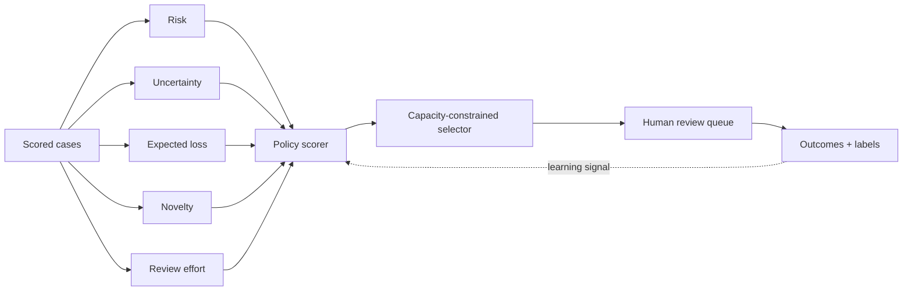

# ReviewerIQ

**Human-review optimization for security and fraud decision systems.**

<p align="center"></p>

ReviewerIQ addresses a production constraint that model accuracy alone does not solve:

> **What should humans review when the queue is larger than the available analyst capacity?**

Rather than simply sending the highest risk scores, ReviewerIQ compares multiple allocation policies under the **same review-time budget** and measures how much severe risk, expected loss, novelty, and information value each policy captures.

## What it demonstrates

- Capacity-constrained queue selection
- Risk, uncertainty, expected loss, novelty, queue age, and review effort
- Random, risk-only, uncertainty-only, expected-value, and hybrid policies
- Utility-per-review-minute ranking
- Severe-case recall and review precision
- Risk caught per analyst hour
- Information-gain and novelty coverage
- Explicit missed-severe-case and queue-backlog metrics
- Apple-inspired Streamlit product UI with 20 KPIs
- CLI, tests, Docker, and CI

## Architecture



## Optimization objective

The default hybrid policy balances immediate expected risk with **information value** and review cost. Selection is performed by utility per minute until the analyst-hour budget is exhausted.

The dashboard compares that result with simpler policies under the same budget.

## Run

```bash
pip install -r requirements.txt
python engine.py --out artifacts --capacity-hours 80 --policy hybrid
streamlit run app.py
```

## Responsible interpretation

The queue, outcomes, expected loss, and “risk caught” values are synthetic. ReviewerIQ is a reference implementation for human-review allocation, not an autonomous enforcement system.

---
**Optimize the review budget, not just the risk score.**
